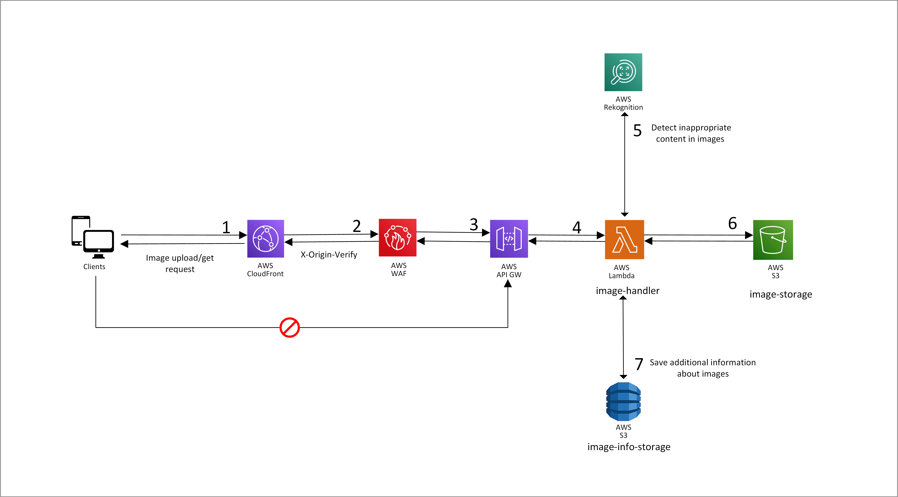
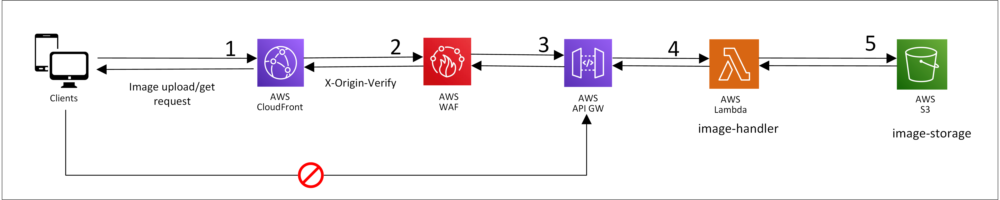
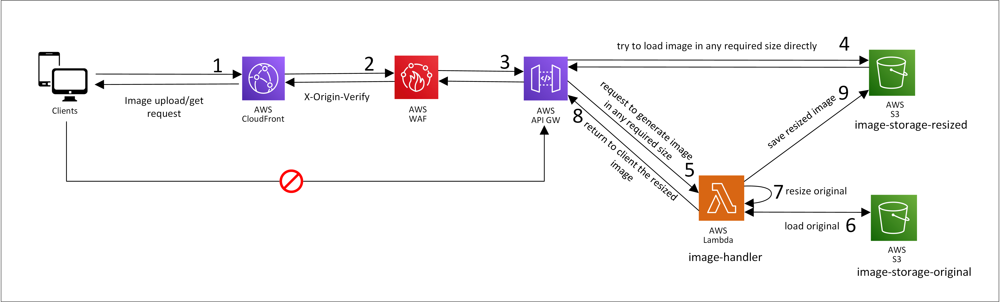

# image-scaler

### The key points

* The ImageScaler is a serverless solution, which can be used for storing and receiving images.
* The original images are stored on S3 bucket.
* Images are scaled to the right format when they are requested.
* Images can't be accessed directly because they are protected by the ["signed URL"](https://docs.aws.amazon.com/AmazonCloudFront/latest/DeveloperGuide/private-content-signed-urls.html) feature.
* The main service is *"image-handler"*.
It is based on AWS Lambda service, which can automatically scale and has fast response time if we keep enough "warm" instances.
* The *"image-handler"* has the following possibilities:
  * resize images, convert formats and optimize image size;
  * detect napropriate content in images by using AWS Rekognition service;
  * save and retrieve images from S3 storage;
  * save and retrieve information from DynamoDB;
* Tracing is configured for the whole flow, so we can check forany issues or bottlenecks.

### Image Upload Workflow

The numbers below correspond to the numbers in the diagram above.

1. The client application sends HTTP request when uploading images. First of all it passes CloudFront.
2. Then, the request comes to AWS WAF service, where "X-Origin-Verify" header is checked if it is valid.
3. Then, API Gateway passes the request to the *image-handler*.
4. The *image-handler* optimizes image size and sends image to the AWS Rekognition service to check if image contains inappropriate content.
5. If some inappropriate content was deteched, this information will be saved in Dynamo DB(Step 7) and image will be blured by the *image-handler*.
6. Image is saved to S3 storage.
7. All necessary information is saved in DynamoDB

### Image Request Workflow V1

1. The client application sends HTTP request when requesting images. First of all it passes CloudFront.
2. Then, if image is not cached in Cloudfront, the request comes to AWS WAF service.
3. AWS WAF checks "X-Origin-Verify" header if it is valid.
4. Then, API Gateway passes the request to the *image-handler*.
5. The *image-handler* loads image from S3 Storage and resizes to the right format(parsed from parameters in the URL) and returnes the image to the user.

### Image Request Workflow V2

4. First of all, client tries to load image from the S3 bucket "image-storage-resized in required size
5. If image does not exist, client requests to generate the image in required size
6. The "image-handler" loads the original image
7. The "image-handler" resizes image to the required format
8. The "image-handler" returns image to the client in requested format
9. The "image-handler" saves generated image to the S3 bucket "image-storage-generated"
